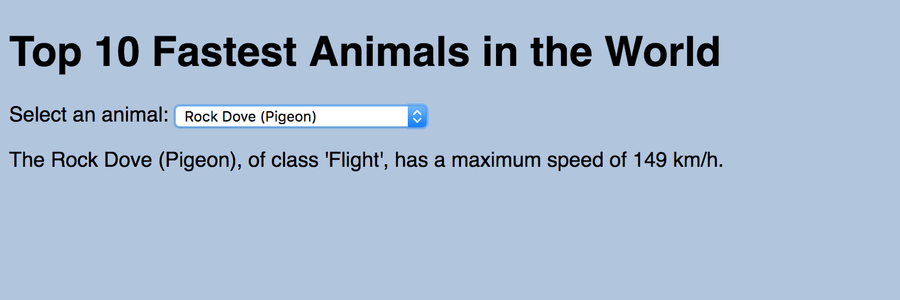

# Modular Front-end with Pub/Sub: Fastest Animals

**Duration: 60 minutes**

### Learning Objectives

- Know how to structure a pub/sub application with initial data
- Know how to dynamically populate a select element with option elements

## Intro

We have been using the pub/sub architectural pattern to build front-end application. In this lesson we are going to look at an application that implements the pub/sub pattern and has some initial data that it uses to populates the page.

## Top 10 Fastest Animals Application

*Application Architecture*

Run the fastest animals app in the browser. To familiarise yourself with the application do the following:

- Anywhere you are not sure what a value is, use `console.log` and/or the debugger to inspect it
- Change the variables to have names that are meaningful to you
- Use the Chrome dev tools - looking at the Elements tab will help you see how the JavaScript is manipulating the DOM

Complete the tasks and answer the questions:

### Tasks

1. Draw a diagram of the application architecture detailing the views and models.
2. Draw a diagram of the event and data flow through the application, detailing the publishing and subscribing with the data being passed between components.

### Questions

1. What the model `Animals` responsible for?

A. The Animals model is responsible for    holding
  all the animals info. Database. It then receives a
  value from select_view and returns the object from the array Animals.
  THIS MUST BE RUN LAST IN app.js so the views can accept the info.

2. What is the view `SelectView` responsible for?

A. Shows all animal species for selection from the array in animals.js. Returns the index from animals.js.

3. What does the `SelectView`'s `populate` method do?

A. Populates the data from the indexed object selected in animals.js

4. What is the view `AnimalInfoView` responsible for?

A. It removes the previous selection from the container and populates what the select_view has published

5. What is app.js responsible for?

A. App is what runs the views and models and allows them to communicate.
