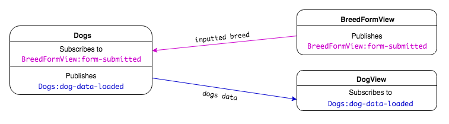
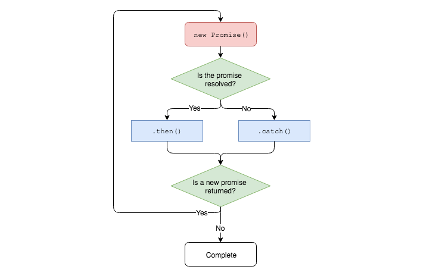

# Promises

**Lesson Duration: 60 minutes**

### Learning Objectives

- Understand the benefits of Promises
- Be able to return a Promise from a function
- Be able to use `.then` chains to handle asynchronicity
- Be able to use `.catch` for error handling
- Be able to use `fetch` to request data

## Intro

We previously learned about the `XMLHttpRequest` web API and how we can use it to make requests without refreshing the page or loading another page. As we've seen, this can be particularly useful for requesting data from JSON APIs and using it to update the information that we're displaying in the browser in real-time.

We know that `XMLHttpRequest` requests are asynchronous, which means we when we make a request we don't know when we will receive the data. We have been using callbacks to handle this asynchronicity, where we pass the request a function and say, 'once the data has been received, invoke this function'.

In this lesson we're going to look at Promises, which we can use to clean up our request code. Promises are fantastic for dealing with asynchronous code, vastly reducing the need to pass callbacks around and making it feel a little bit more structured.

Finally, we'll look at `fetch`, another web API, which uses `Promise` objects to take a lot of the leg work out of making requests.

> Instructor note: Hand out the start code

### Dogs Application

We are going to create an application that allows users to input the breed of a dog, and see a collection of photographs of dogs of that breed displayed on the page. We are using the [dogs.ceo API](https://dog.ceo/).

The application is almost complete. It already has models and views that are responsible for making the API request and displaying the data on the page.



*Application pub/sub event and data flow diagram*

The only thing that we still have to do is to write the HTTP request in helpers/request.js.

## `XMLHttpRequest`

We'll begin by writing a method, `get`, which makes an HTTP request to get data from an API. Once we've done that, we'll rewrite the method using a Promise.

### Task: 10 mins

Complete the `Request.prototype.get` method:

- Make a request to the provided URL
- When the request has completed, call `onComplete`, passing the resulting data as an argument

<details>
<summary>Example solution</summary>

```js
Request.prototype.get = function (onComplete) {
  const xhr = new XMLHttpRequest();
  xhr.open('GET', this.url);
  xhr.send();

  xhr.addEventListener('load', () => {
    if (xhr.status !== 200) {
      console.error(`Uh oh! The status code is ${ xhr.status }!`);
      return;
    }

    const jsonString = xhr.responseText;
    const data = JSON.parse(jsonString);
    onComplete(data);
  });
}
```

> Note: Check the browser console when making the request. If the status code is 404, the request has not been successful and you may have a typo in the dog breed.

</details>

How do we deal with the asynchronicity of the request? We use a callback. The `get` method takes a callback (`onComplete`) which is invoked once the data has been received and parsed. This can get hard to follow, particularly if the chain of callbacks grows, which is where Promises can help us.

## `XMLHttpRequest` Using a `Promise`

### What is a `Promise`?

We typically create a `Promise` when we want to retrieve data via some asynchronous operation. This could be requesting data from an API or a database, for example.

Just like a real life promise that represents something that will happen in the future, a JavaScript `Promise` object represents the result of an asynchronous operation. In our case the `Promise` object will represent the data that we hope to get back from the Dogs.ceo API. With regards to asynchronous JavaScript, this allows us to use the `return` keyword inside of functions without worrying that the data might not have been received yet.

We can `return` a `Promise` and then decide what to do once the asynchronous operation has completed. This allows us to pass fewer callbacks around, meaning that our code reads a bit more as if it were synchronous, which can be easier to follow.

### How Does a `Promise` Work?

When we create a `Promise` object it will be pending until the asynchronous operation that we are wrapping has completed. Then, just like a real life promise that can be kept or broken, the `Promise` object will either `resolve`, if successful, or `reject` if something goes wrong, allowing us to decide what to do next. We may want to render the data that was received, or perform some kind of error handling if the `Promise` rejected.

We can also chain multiple asynchronous operations by chaining functions which return a `Promise`.



_A Promise Chain_

### Creating a `Promise`

Now that we know what a `Promise` is, let's refactor our `get` method so that it returns a `Promise`.

We can create `Promise` objects using the `Promise` constructor. Let's create and return one at the beginning of our `get` method, leaving everything else as it was. This promise represents the data, which we will eventually get back from our `XMLHttpRequest`.

```js
// helpers/request.js

Request.prototype.get = function () {
  return new Promise();	 // NEW

  // ...
}
```

When we create a `Promise` object we need to pass a callback function to it. This will contain the asynchronous code that we want to execute. In this case this will be our `XMLHttpRequest`.

```js
Request.prototype.get = function () {
  return new Promise(() => { // MODIFIED

  });
  // ...
}
```

This callback has to have two parameters: `resolve` and `reject`. These refer to the code that we will execute if our request is successful or unsuccessful. Let's add those parameters to our callback.

```js
Request.prototype.get = function () {
  return new Promise(function (resolve, reject) {  // MODIFIED

  });
  // ...
}
```

Next we'll cut and paste our request code into the callback, exactly as it is. It will require a few changes, but we'll get to that in a minute.

```js
Request.prototype.get = function (onComplete) {
  return new Promise((resolve, reject) => {
    const xhr = new XMLHttpRequest(); // MODIFIED
    xhr.open('GET', this.url);
    xhr.send();

    xhr.addEventListener('load', () => {
      if (xhr.status !== 200) {
        console.error(`Uh oh! The status code is ${ xhr.status }!`);
        return;
      }

      const jsonString = xhr.responseText;
      const data = JSON.parse(jsonString);
      onComplete(data);
    });
  });
}
```

Currently, if the server responds with a status code other than 200 all we do is `return` to prevent the rest of our code from executing. Let's invoke our `reject` behaviour instead, passing in an error message that could be used for error handling.

We'll also use the resolve behaviour in place of `onComplete`.

```js
// ...
xhr.addEventListener('load', () => {
  if (xhr.status !== 200) { // MODIFIED
    reject(`Uh oh! The status code is ${ xhr.status }!`);
  }

  const jsonString = xhr.responseText;
  const data = JSON.parse(jsonString);
  resolve(data); // MODIFIED
});
// ...
```

Notice that we aren't using the `onComplete` callback any more. Let's remove the unused parameter as we'll be using `resolve` instead.

```js
Request.prototype.get = function () { // MODIFIED
  // ...
}
```

## Using Our New `get` Method

Everything in `get` should be working now. We just need to make a few changes to models/dogs.js, and then our app should work again.

First, let's remove the `onComplete` argument that we're passing to `get`. We won't need it any more. As `get` returns a `Promise` object now, we're able to call `then` on the returned `Promise` object, telling it what to do once it has resolved. In this case we want to call `onComplete`, so we'll pass `onComplete` to `then`.

```js
// models/dogs.js

const myPromise = request.get();
myPromise.then((data) => {
  this.data = data.message;
  PubSub.publish('Dogs:dog-data-loaded', this.data);
});
```

You'll typically see this writen as a method chain.

```js
request.get().then((data) => {
  this.data = data.message;
  PubSub.publish('Dogs:dog-data-loaded', this.data);
});
```

This is usually split into multiple lines and indented for readability. Notice that are no semicolons until the end of the method chain.

```js
request.get()
  .then((data) => {
    this.data = data.message;
    PubSub.publish('Dogs:dog-data-loaded', this.data);
  })
```

Great. Our images should now be loading in the browser again.

As well as using `then` to define the behaviour that we want to execute if our request is successful, the `resolve` callback in our `get` method, we can use `catch` to define the behaviour that we want to execute if our request fails.

```js
request.get()
  .then((data) => {
    this.data = data.message;
    PubSub.publish('Dogs:dog-data-loaded', this.data);
  })
  .catch((err) => {
    console.error(err);
  });
```

The implementation of our `get` method has become a little bit more complex, but consuming it in the rest of our code has become easier. We could even use different methods of error handling for different requests now, so our code has become more dynamic.

Next we'll look at how we can use `fetch` to reduce our `get` method to a couple of lines of code.

## `fetch`

Like `XMLHttpRequest`, `fetch` is a web API which we can use to make HTTP requests. `fetch` is essentially a wrapper around `XMLHttpRequest` but implemented using promises.

`fetch` offers very concise syntax which will allow us to reduce our `get` method down to a couple of lines of code while being almost functionally identical.

First we'll delete the body of our `get` method.

```js
Request.prototype.get = function () {

}
```

Previously, we had to create and return a `Promise` object. `fetch` does this for us. We'll invoke `fetch`, passing our URL to it, and return the Promise object which it gives back to us.

```js
Request.prototype.get = function () {
  return fetch(this.url); // NEW
}
```

Believe it or not, we're half way there already.

As we discussed, `fetch` returns a `Promise` object. This object represents the `Response` that we will get back from the server that we're making our request to.

We can use `then`, just like we did earlier, to decide what to do next. If there's a problem then it will be caught by the `catch` clause in models/dogs.js.

`fetch` will pass the `Response` object to our `then` callback.

```js
Request.prototype.get = function () {
  return fetch(this.url)
    .then((response) => {
      return response.json();
    });
}
```

As our callback only contains a single statement, we can utilise the implicit return feature of our arrow function. We can also omit the parenthesis around the parameter list as the function only as a single argument.

```js
Request.prototype.get = function () {
  return fetch(this.url)
    .then(response => response.json());
}
```

That's it. We're done!

Under the hood `fetch` is working much the same way that our code did previously, but that's all hidden away from us. All we have to worry about is giving a URL to `fetch` and then handling the `Response` object once we get it back.

## Recap

What are some of the advantages of using a promises when writing asynchronous JavaScript?

<details>
<summary>Answer</summary>
Promises allow us to write asynchronous code that reads as a structured series of events, rather than a series of callbacks, which can be more difficult to follow.
</details>

<br>

Which method do we call after receiving a `Promise` to determine which behaviour we want to execute it resolves successfully?

<details>
<summary>Answer</summary>
`then`
</details>

<br>

Which method do we call after receiving a `Promise` to determine which error handling behaviour we want to execute it rejects?

<details>
<summary>Answer</summary>
`catch`
</details>

<br>

How do we write a function that can be chained using `then` and `catch`?

<details>
<summary>Answer</summary>
We must return a `Promise` object from a function.
</details>

## Conclusion

Now that we've learned how to use `Promise` objects and the `fetch` web API, we can write asynchronous JavaScript that almost reads as if it were synchronous. Our code appears more like a structured series of events, even if we aren't sure exactly _when_ things will happen. In short, promises allow us to write neater code.

`fetch` also abstracts away some of the lower level implementation details of our HTTP request. We don't really have to care exactly how `fetch` is implemented, we just care that we get our data back.

This isn't all that there is to learn about promises, however. Promises really come into their own when it comes to carrying out multiple asynchronous operations either sequentially, using a `then` chain, or at the same time, using `Promise.all`.

## Further Resources

MDN - [Promises](https://developer.mozilla.org/en-US/docs/Web/JavaScript/Reference/Global_Objects/Promise)  
MDN - [`Promise.all`](https://developer.mozilla.org/en-US/docs/Web/JavaScript/Reference/Global_Objects/Promise/all)
